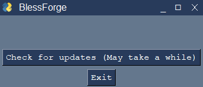
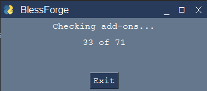
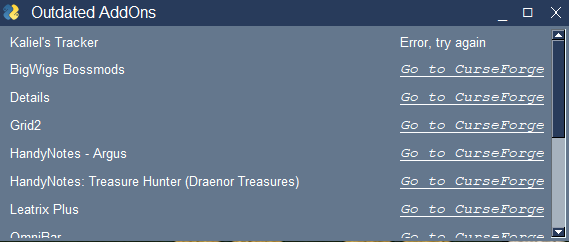

# BlessForge
A tool for checking if World of Warcraft add-ons have been updated on CurseForge.com using Selenium, Pandas, and PySimpleGUI.
## Table of Contents
* [General Info](#general-information)
* [Technologies Used](#technologies-used)
* [Screenshots](#screenshots)
* [Remaining Tasks](#remaining-tasks)
* [Setup and Usage](#setup-and-usage)
* [Additional Files](#additional-files)

## General Information
This project was done as part of [TovTech.org](https://tovtech.org). A company founded by and for people with disabilities. We offer a variety of services in the field of data.

CurseForge.com, a popular website for hosting World of Warcraft add-ons made their API private, which means it is no longer possible to use third-party applications to directly update and install add-ons. They offer their own official client, but many users would prefer not to use it for various reasons such as privacy concerns. This tool aims to provide an alternative. Although it cannot automatically download and install add-ons directly, it checks the add-ons that are installed locally against the website to see which ones need to be updated, and provides a link directly to the download page.

Not every add-on is supported currently because I have to add them manually to the CSV, so if there's an add-on you'd like me to add send me a message and I'll add it when I can.

## Technologies Used
- Selenium 4.3.0
- Pandas 1.4.2
- PySimpleGUI 4.60.2
 
## Screenshots
Initial screen:

While checking:

Result:

  

## Setup and Usage
Download `blessforge.exe`, and run the exe.

## Additional Files
- AddOns.zip - An example add-ons folder I am using for testing
- addon_folders.csv - A table that matches folder names to add-on names and their corresponding CurseForge url suffix
