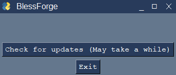
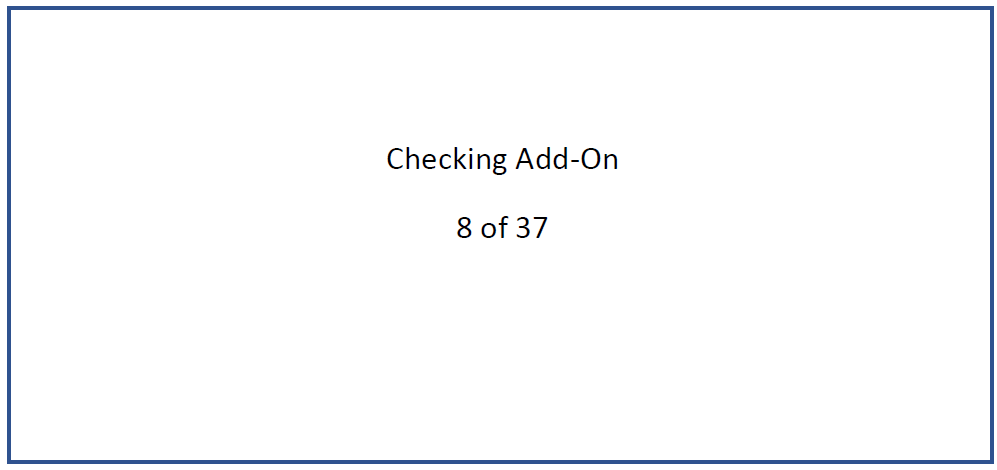
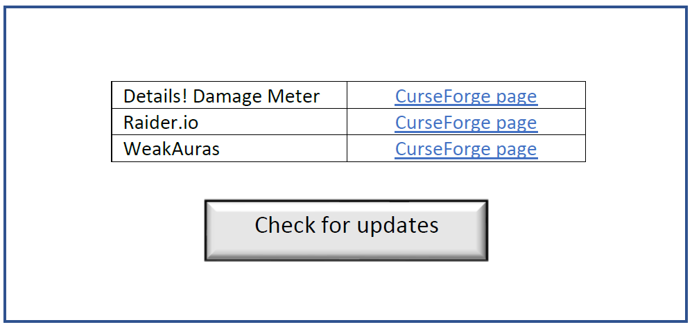

# BlessForge - WIP
A tool for checking if World of Warcraft add-ons have been updated on CurseForge.com using Selenium, Pandas, and PySimpleGUI.
## Table of Contents
* [General Info](#general-information)
* [Technologies Used](#technologies-used)
* [Screenshots](#screenshots)
* [Remaining Tasks](#remaining-tasks)
* [Setup](#setup)
* [Usage](#usage)
* [Additional Files](#additional-files)

## General Information
CurseForge.com, a popular website for hosting World of Warcraft add-ons made their API private, which means it is no longer possible to use third-party applications to directly update and install add-ons. They offer their own official client, but many users would prefer not to use it for various reasons such as privacy concerns. This tool aims to provide an alternative. Although it cannot automatically download and install add-ons directly, it checks the add-ons that are installed locally against the website to see which ones need to be updated, and provides a link directly to the download page.

## Technologies Used
- Selenium 4.3.0
- Pandas 1.4.2
- PySimpleGUI 4.60.2
 
## Screenshots
_Currently this is just a sketch of what the tool is intended to look like, I will replace these with screenshots once the GUI is implemented_
Initial screen:

While checking:

Result:


## Remaining Tasks
- Implement GUI
- Handle locating and working with the World of Warcraft installation folder

## Setup
Install the required packaegs listed in [technologies](#technologies-used) and clone this repository.

## Usage
Got to this repo's root directory and run ```python main.py```

## Additional Files
- AddOns.zip - An example add-ons folder I am using for testing
- addon_folders.csv - A table that matches folder names to add-on names and their corresponding CurseForge url suffix
